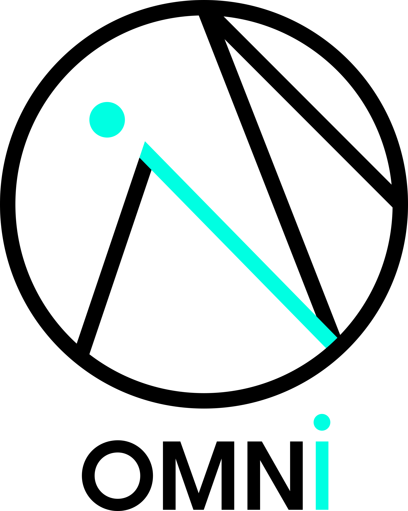

<a name="logo" href = "https://vitreo12.github.io/omni">
    <div align="center">
        
    </div>
</a>

<br>
Omni is a cross-platform DSL (Domain Specific Language) for low level audio programming. 
It aims to be a new, expressive and easy to use programming language to code audio algorithms in.

Omni leverages nim and C to  compile code to self-contained static or shared libraries that can then be loaded and used anywhere. So far, two wrappers have already been written to compile omni code to [SuperCollider](https://supercollider.github.io/) UGens ([omnicollider](https://github.com/vitreo12/omnicollider)), or [Max 8](https://cycling74.com/) objects ([omnimax](https://github.com/vitreo12/omnimax)).

Also, a basic syntax highlighting [VSCode](https://code.visualstudio.com/) plugin is available by simply looking for [omni](https://github.com/vitreo12/vscode-omni) in the Extensions Marketplace.

## **Requirements**

1) [nim](https://nim-lang.org/)
2) [git](https://git-scm.com/)

### **Linux**

Refer to your distribution's package manager and make sure you've got installed `nim` and `git`.

### **MacOS**

To install dependencies on MacOS it is suggested to use a package manager like [brew](https://brew.sh/). 
To install `brew`, simply open the `Terminal` app and run this command :
    
    /bin/bash -c "$(curl -fsSL https://raw.githubusercontent.com/Homebrew/install/master/install.sh)"

After `brew` has been installed, run the following command in the `Terminal` app to install `nim`:

    brew install nim

Then, make sure that the `~/.nimble/bin` directory is set in your shell `$PATH`.
If using bash (the default shell in MacOS), simply edit (or create if it doesn't exist) the `~/.bash_profile` file and add this line to it: 

    export PATH=$PATH:~/.nimble/bin

### **Windows:**

To install dependencies on Windows it is suggested to use a package manager like [scoop](https://scoop.sh/). 
To install `scoop`, simply open `PowerShell` and run this command :
    
    iwr -useb get.scoop.sh | iex

After `scoop` has been installed, run the following command in `PowerShell` to install `nim` and `git`:

    scoop install nim git

## **Installation**

To install `omni`, simply use the `nimble` package manager (it comes bundled with the `nim` installation):

    nimble install omni

## **Usage**

Once you've installed omni, the `omni` executable will be placed in your `~/.nimble/bin` folder.

Run `omni -h` to get help on all the available flags.

When running the `omni` compiler, the output is either a static or shared library (depending on the `--lib` flag). Along with it, an `omni.h` file (depending on the `--exportHeader` flag) containing all the callable functions in the shared/static library will be exported.

    omni ~/.nimble/pkgs/omni-0.1.0/examples/OmniSaw.omni -o:./

This command will compile an antialiased sawtooth oscillator (part of the examples) to a shared library (`libOmniSaw.so/dylib/dll`), together with a header file (`omni.h`), in the current folder.

## **Sine oscillator example**

```nim
ins:  1
outs: 1

init:
    phase = 0.0

sample:
    freq_incr = in1 / samplerate
    out1 = sin(phase * TWOPI)
    phase = (phase + freq_incr) % 1.0
```

## **Website / Docs**

Check omni's [website](https://vitreo12.github.io/omni).